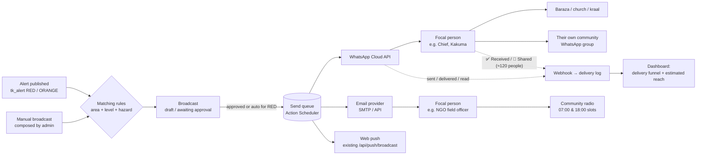
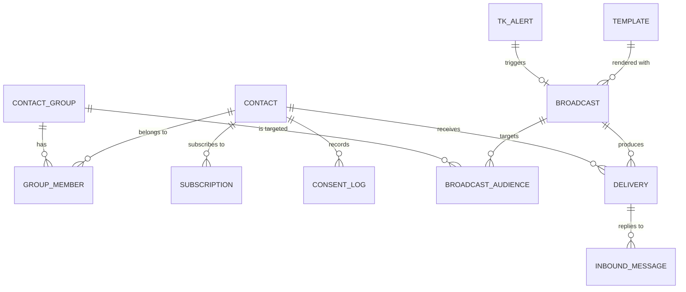
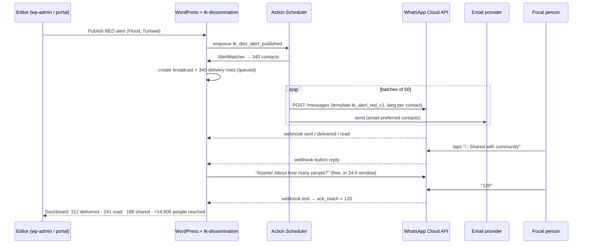

# Karamoja Climate Hub — Alert Dissemination Module (Focal Persons & Batch Alerts)

**Scope:** Design for a recipient database (individuals and groups) that receives batch alerts by WhatsApp and email, then cascades them to communities
**Stack:** Headless WordPress (`C:\xampp\htdocs\karamoja-cluster-fe`) + Next.js 15 / MUI 5 / JS (`C:\projects\karamoja-cluster-fe`)
**Decisions taken:** backend lives in WordPress (new plugin); WhatsApp via **Meta Cloud API direct**; recipient lists managed by **Hub admins / DRC staff**
**Date:** 3 Oct 2026

---

## 1. Short answer

Yes, and it fits well. The platform already publishes structured alerts (`tk_alert` with `alert_level`, `area`, `target_groups`, `valid_until`, lat/lng) and the TOR expects "cascading EWS alerts to vulnerable communities". What's missing is the **last-mile layer**: a list of trusted people who receive each alert on their phone and pass it on through barazas, radio, churches, kraals and their own WhatsApp groups.

This document proposes a **Dissemination module** with:

1. A **Focal Persons directory**: individuals (chiefs, CHVs, peace committee members, ward administrators, radio presenters, women/youth group leaders, kraal leaders, NGO field staff) with location, language, channel preferences and consent.
2. **Recipient groups**: static lists ("Turkana North CHVs") and dynamic segments ("everyone in Loima + Turkana West who speaks Turkana and subscribes to drought").
3. A **broadcast engine**: an alert, or a manual message, becomes a broadcast. The engine queues it, sends it by WhatsApp and/or email in rate-limited batches, and tracks every message.
4. A **cascade feedback loop**: focal persons tap *✅ Received* / *📢 Shared with community* on the WhatsApp message. The Hub can then report *estimated community reach*, not just "messages sent".
5. **Admin UI** in the Next.js dashboard (MUI) plus a "Disseminate" panel on the alert edit screen.

---

## 2. How the cascade works



### Important WhatsApp constraint: "groups"

The Meta Cloud API **cannot post into the community's existing WhatsApp groups** (e.g. "Lokichoggio Elders"). So a "group" in this module is a **recipient list of individual numbers**. To reach an existing community WhatsApp group, add that group's **admin/focal person** as a contact. They receive the alert 1-to-1 and forward it into the group. This is the cascade model in any case, and it keeps an accountable person in the loop.

---

## 3. Platform rules that shape the design

| Rule (WhatsApp Cloud API) | Design consequence |
|---|---|
| Business-initiated messages must use a **pre-approved template** | Each alert type/level gets an approved **Utility** template per language with variables (`{{1}}` hazard, `{{2}}` area…). Free-text only goes out inside the 24-h window |
| **24-hour customer-service window** opens when the recipient messages you. Free-form messages, and utility templates, are free inside it | When a focal person replies or taps a button, follow-ups (full advisory text, PDF) are sent as normal messages within the window |
| **Per-message pricing** (since 1 Jul 2025): charged per *delivered* template; Kenya and Uganda are in the "Rest of Africa" rate region | Cost ≈ recipients × templates per broadcast × utility rate. Check Meta's current rate card before budgeting. Avoid sending separate messages where one will do |
| **Messaging limits**: start at **250 unique contacts / 24 h** per business portfolio. 2,000 after business verification, then automatic scaling to 10k / 100k / unlimited when quality stays high | Complete **Meta Business Verification (DRC)** before launch. The engine enforces a daily cap and spreads larger broadcasts |
| **Quality rating**: blocks or reports by recipients lower the rating and can pause templates | Only message people who **opted in**. Keep messages short and relevant. Honour `STOP` immediately |
| Throughput is limited per phone number (default ~80 msg/s) | Batch sending through a queue (50 per job) is far below the limit; no special handling needed at this scale |
| Webhooks deliver `sent`, `delivered`, `read`, `failed` statuses and inbound replies, signed with `X-Hub-Signature-256` | Public webhook endpoint with signature verification; statuses written to the delivery log |

Email has fewer rules but needs **SPF, DKIM and DMARC** on the sending domain, a transactional provider (Postmark, Amazon SES or Brevo; the audit already flags that `wp_mail` doesn't work on XAMPP), and a `List-Unsubscribe` header.

---

## 4. Backend design (WordPress)

### 4.1 Where it lives

A new versioned plugin **`tk-dissemination`**, written in the PSR-4 structure recommended in the system audit (§6). Don't add to the 3,600-line `turkana-headless-hub.php`.

```
wp-content/plugins/tk-dissemination/
├── tk-dissemination.php            # bootstrap, activation (dbDelta), caps
├── src/
│   ├── Schema.php                  # custom tables + migrations
│   ├── Repo/ContactRepo.php        # CRUD, search, segment resolution
│   ├── Repo/GroupRepo.php
│   ├── Repo/BroadcastRepo.php
│   ├── Repo/DeliveryRepo.php
│   ├── Rules/AlertMatcher.php      # alert → recipients
│   ├── Channels/ChannelInterface.php
│   ├── Channels/WhatsAppCloud.php
│   ├── Channels/Email.php
│   ├── Channels/WebPush.php        # wraps existing Next /api/push/broadcast
│   ├── Queue/Dispatcher.php        # Action Scheduler jobs
│   ├── Rest/ContactsController.php
│   ├── Rest/GroupsController.php
│   ├── Rest/BroadcastsController.php
│   ├── Rest/TemplatesController.php
│   ├── Rest/WebhookController.php  # Meta + email provider callbacks
│   ├── Admin/AlertMetaBox.php      # "Disseminate" panel on tk_alert
│   └── Cli/Commands.php            # wp tk-diss import / resend / stats
└── vendor/woocommerce/action-scheduler
```

**Why custom tables instead of CPTs:** contacts hold PII and need to stay out of `/wp/v2` (see audit P0-8). Delivery logs grow by *recipients × broadcasts* rows. Both need indexed queries by phone, region and status. CPT post meta would be slow and would leak through REST.

### 4.2 Data model



| Table | Key columns | Notes |
|---|---|---|
| `wp_tk_contacts` | `id`, `full_name`, `role` (enum, see below), `organization_id` (→ `tk_organization`), `phone_e164`, `whatsapp_opt_in` (bool), `email`, `email_opt_in`, `preferred_channel` (`whatsapp`/`email`/`both`), `language` (`en`,`sw`,`tu`,`pk`,`ng`), `country`, `county_district`, `sub_county`, `ward`, `village`, `latitude`, `longitude`, `reach_estimate` (int, people they typically reach), `status` (`pending_consent`/`active`/`paused`/`opted_out`), `verified_at`, `last_ack_at`, `notes`, `created_by`, `created_at`, `updated_at` | Unique on `phone_e164` and on `email`. Phone normalised to E.164 (`+2547…`, `+2567…`) on save |
| `wp_tk_contact_groups` | `id`, `name`, `slug`, `description`, `type` (`static`/`dynamic`), `rules_json` (for dynamic), `owner_user_id`, `created_at` | Dynamic rules example: `{"regions":["turkana-west","loima"],"roles":["chv","chief"],"languages":["tu"]}` |
| `wp_tk_group_members` | `group_id`, `contact_id`, `added_by`, `added_at` | Static groups only |
| `wp_tk_subscriptions` | `contact_id`, `hazard` (`drought`,`flood`,`disease`,`conflict`,`pest`,`all`), `min_level` (`yellow`/`orange`/`red`) | Lets a contact receive only what matters to them |
| `wp_tk_consent_log` | `contact_id`, `channel`, `action` (`opt_in`/`opt_out`), `source` (`paper_form`,`whatsapp_reply`,`admin`,`email_link`), `evidence` (text/file ref), `recorded_by`, `at` | Required under Kenya DPA 2019 / Uganda DPPA 2019 |
| `wp_tk_templates` | `id`, `key` (`alert_red`, `alert_orange`, `advisory_general`…), `channel`, `language`, `meta_template_name`, `meta_status` (`APPROVED`/`PENDING`/`REJECTED`), `body_preview`, `variables_json`, `email_subject`, `email_html` | Mirrors templates approved in WhatsApp Manager |
| `wp_tk_broadcasts` | `id`, `source` (`alert`/`manual`), `alert_id`, `title`, `message_text`, `template_key`, `channels` (set), `status` (`draft`/`awaiting_approval`/`scheduled`/`sending`/`completed`/`cancelled`/`failed`), `scheduled_at`, `approved_by`, `approved_at`, `created_by`, `stats_json` (cached counters) | One row per send-out |
| `wp_tk_broadcast_audience` | `broadcast_id`, `group_id` *or* `contact_id` | Snapshot of the intended targets |
| `wp_tk_deliveries` | `id`, `broadcast_id`, `contact_id`, `channel`, `language`, `idempotency_key` (unique: broadcast + contact + channel), `provider_message_id`, `status` (`queued`/`sent`/`delivered`/`read`/`failed`/`skipped`), `error_code`, `attempts`, `ack` (`received`/`shared`/`need_info`), `ack_reach` (int), `sent_at`, `delivered_at`, `read_at`, `ack_at` | Main reporting table. Index on `(broadcast_id,status)` and `provider_message_id` |
| `wp_tk_inbound_messages` | `id`, `contact_id`, `phone_e164`, `delivery_id` (nullable), `type` (`button`/`text`/`media`), `body`, `received_at`, `handled_by`, `handled_at` | Replies and questions from the field, shown in an inbox |

**Contact roles (enum, editable later as a taxonomy):** `chief`, `assistant_chief`, `ward_admin`, `chv` (community health volunteer), `peace_committee`, `religious_leader`, `women_group_leader`, `youth_leader`, `kraal_leader`, `radio_presenter`, `teacher`, `ngo_field_officer`, `government_officer`, `other`.

**Geography:** use the same keys as the planned `tk_country → tk_region` taxonomy (audit §5.2), so alert `area` and contact location match without fuzzy string comparison. Until that taxonomy exists, keep a small mapping table and normalise both sides to region slugs.

### 4.3 Matching: who gets an alert?

```php
// src/Rules/AlertMatcher.php (sketch)
public function resolve(int $alert_id): array {
    $level   = get_post_meta($alert_id, 'alert_level', true);      // red|orange|yellow|green
    $regions = $this->regions_for_alert($alert_id);                // area/lat-lng → region slugs (+ parent county)
    $hazard  = $this->hazard_for_alert($alert_id);                  // advisory_type → hazard key

    // 1) contacts in the affected regions who subscribe to this hazard at this level or above
    // 2) plus explicit "always notify" groups (e.g. County Disaster Committee) set in plugin settings
    // 3) minus opted_out / paused / no consent for the channel
    return $this->contacts->find_matching([
        'regions'   => $regions,
        'hazard'    => $hazard,
        'min_level' => $level,
        'status'    => 'active',
    ]);
}
```

**Default policy (configurable in settings):**

| Alert level | Behaviour |
|---|---|
| RED | Broadcast created and **sent immediately** to matching contacts, and the reviewer is notified. Speed beats a second approval |
| ORANGE | Broadcast created as **awaiting approval**. One click to send from the alert screen or dashboard |
| YELLOW / GREEN | No automatic broadcast. Admin can send manually, or include it in a weekly digest (email) |

This plugs into the publish hook the audit already recommends (§5.5) for revalidation and web push, so one `transition_post_status` handler does all three:

```php
add_action('transition_post_status', function ($new, $old, $post) {
    if ($post->post_type !== 'tk_alert' || $new !== 'publish' || $old === 'publish') return;
    as_enqueue_async_action('tk_diss_alert_published', ['alert_id' => $post->ID], 'tk-diss');
}, 10, 3);
```

### 4.4 Sending: queue, batching, retries

- Use **Action Scheduler** (the battle-tested queue bundled with WooCommerce, also available standalone). Configure a **real system cron** calling `wp action-scheduler run` every minute. WP-cron depends on site traffic and is not reliable enough for emergencies.
- `Dispatcher::start($broadcast_id)` expands the audience into `wp_tk_deliveries` rows (`queued`). Each row has an `idempotency_key`, so a re-run never double-sends. It then enqueues one job per **batch of 50**.
- Each batch job: load deliveries → render the message per contact language → call the channel adapter → store `provider_message_id` and `sent`, or `failed` with an error code.
- **Retries:** transient errors (HTTP 429/5xx, network) retry with exponential backoff (1, 5, 15 min, max 3). Permanent errors (invalid number, not on WhatsApp, Meta 131026 "undeliverable") are marked `failed` and, if the contact has email, a **fallback email** is queued.
- **Daily cap guard:** the dispatcher counts unique WhatsApp recipients in the last 24 h. If a broadcast would exceed the current Meta tier, it sends to the highest-priority roles first and holds the rest with a dashboard warning.

```php
// src/Channels/ChannelInterface.php
interface ChannelInterface {
    /** @return array{ok:bool, provider_id?:string, error_code?:string, retryable?:bool} */
    public function send(array $contact, array $message): array;
    public function supports(array $contact): bool;   // opt-in + address present
}
```

### 4.5 WhatsApp adapter (Meta Cloud API)

```php
// src/Channels/WhatsAppCloud.php (core call)
$res = wp_remote_post("https://graph.facebook.com/{$this->api_version}/{$this->phone_number_id}/messages", [
    'timeout' => 15,
    'headers' => [
        'Authorization' => 'Bearer ' . TK_WA_ACCESS_TOKEN,   // permanent System User token, from wp-config/env
        'Content-Type'  => 'application/json',
    ],
    'body' => wp_json_encode([
        'messaging_product' => 'whatsapp',
        'to'       => ltrim($contact['phone_e164'], '+'),
        'type'     => 'template',
        'template' => [
            'name'     => $tpl['meta_template_name'],          // e.g. tk_alert_red_v1
            'language' => ['code' => $tpl['language']],        // en, sw, …
            'components' => [
                ['type' => 'body', 'parameters' => [
                    ['type' => 'text', 'text' => $msg['hazard']],        // {{1}}
                    ['type' => 'text', 'text' => $msg['area']],          // {{2}}
                    ['type' => 'text', 'text' => $msg['valid_until']],   // {{3}}
                    ['type' => 'text', 'text' => $msg['action_1']],      // {{4}}
                ]],
                ['type' => 'button', 'sub_type' => 'url', 'index' => '0',
                 'parameters' => [['type' => 'text', 'text' => $msg['alert_slug']]]],
            ],
        ],
    ]),
]);
```

**Template example (`tk_alert_red_v1`, Utility, English):**

> 🔴 **RED ALERT – {{1}}**
> Area: {{2}}
> Valid until: {{3}}
> Action now: {{4}}
> Please share with your community and reply below.
> *[View full advisory]* (URL button → `https://www.karamoja.org/early-warnings/{{1}}`)
> *[✅ Received]* *[📢 Shared with community]* *[❓ Need more info]*

Note that templates can't mix a URL button with quick-reply buttons in every layout. If Meta rejects the combination, use the three quick replies and put the link in the body text.

**Swahili (`sw`) version:**

> 🔴 **TAHADHARI NYEKUNDU – {{1}}**
> Eneo: {{2}} · Hadi: {{3}}
> Chukua hatua: {{4}}
> Tafadhali shiriki na jamii yako.

Turkana, Pokot and Karimojong (`tu`, `pk`, `ng`) aren't in WhatsApp's template language list. Submit those translations under a supported language code (for example a second English template, `tk_alert_red_tu_v1` with Turkana body text), and record the real language in `wp_tk_templates.language`. Have native speakers review them; Meta reviews templates for category, not translation accuracy.

**Inbound / webhook handling:**

| Event | Action |
|---|---|
| `statuses[].status = sent/delivered/read/failed` | Update the matching `wp_tk_deliveries` row via `provider_message_id` |
| Button reply `✅ Received` | `ack = received`, `ack_at = now` |
| Button reply `📢 Shared` | `ack = shared`. Auto-reply (free, inside the 24-h window): "Asante! About how many people did you share with?" A numeric reply is stored in `ack_reach` |
| Button reply `❓ Need info` | Send the full advisory text + PDF (free-form, within the window); create an inbox item for staff |
| Text `STOP` / `ACHA` | Set `whatsapp_opt_in = false`, write to the consent log, send a confirmation |
| Any other text | Store in `wp_tk_inbound_messages` and show in the dashboard inbox |

Webhook endpoint: `GET/POST /wp-json/tk/v1/dissemination/webhooks/whatsapp`. The GET handles Meta's `hub.challenge` verification. The POST verifies `X-Hub-Signature-256` (HMAC-SHA256 with the app secret) **before** parsing, returns `200` fast, and processes asynchronously through Action Scheduler.

### 4.6 Email adapter

- Send through a provider API (Postmark / SES / Brevo) rather than `wp_mail` bulk BCC. That gives one message per recipient, per-recipient tracking and correct unsubscribe handling.
- Template: responsive HTML with the alert colour band, a plain-text part, the "View advisory" link, PDF attachments for reports, and a footer with the reason for receiving it plus a one-click unsubscribe (`List-Unsubscribe` + `List-Unsubscribe-Post`).
- Email has no reply buttons, so put **"I received this" / "I shared this"** links in the email. These are signed, single-use URLs (`/tk/v1/dissemination/ack?d={delivery_id}&a=shared&sig=…`) that record the acknowledgement.
- Provider webhooks (`delivered`, `bounced`, `complaint`, `opened`) update `wp_tk_deliveries`. Hard bounces and complaints set `email_opt_in = false`.

### 4.7 REST API (`tk/v1/dissemination`)

All routes except webhooks and signed ack links require a new capability **`tk_manage_dissemination`**, granted to `administrator` and the planned `tk_reviewer` role. Partners don't get it (recipient lists are admin-managed).

| Method | Route | Purpose |
|---|---|---|
| GET | `/contacts?search=&region=&role=&language=&status=&group=&page=` | Paginated list (default 25) |
| POST | `/contacts` | Create (validates E.164, dedupes) |
| GET/PATCH/DELETE | `/contacts/{id}` | Read/update/soft-delete (anonymise PII) |
| POST | `/contacts/import` | CSV upload → dry-run report (valid / duplicates / errors) → commit |
| GET | `/contacts/export` | CSV (admin only, logged) |
| POST | `/contacts/{id}/consent` | Record opt-in/out with source + evidence |
| POST | `/contacts/{id}/test` | Send a test message to verify the number/email |
| GET/POST | `/groups` · GET/PATCH/DELETE `/groups/{id}` | Manage groups |
| POST/DELETE | `/groups/{id}/members` | Add/remove contacts (bulk) |
| POST | `/groups/preview` | Resolve dynamic rules → count + sample |
| GET | `/templates` · POST `/templates/sync` | List; pull approval status from Meta |
| POST | `/broadcasts` | Create (from `alert_id` or manual) |
| POST | `/broadcasts/estimate` | Audience count per channel, estimated cost, daily-cap check |
| GET | `/broadcasts?status=&from=&to=` · GET `/broadcasts/{id}` | List / detail with stats |
| POST | `/broadcasts/{id}/approve` · `/send` · `/cancel` · `/retry-failed` | Lifecycle actions |
| GET | `/broadcasts/{id}/deliveries?status=&ack=` | Per-recipient log |
| GET | `/inbox` · PATCH `/inbox/{id}` | Field replies; mark handled |
| GET | `/stats?from=&to=&region=` | Dashboard KPIs |
| GET/POST | `/webhooks/whatsapp` | Meta verification + events (signature-checked) |
| POST | `/webhooks/email` | Provider events (signature-checked) |
| GET | `/ack` | Signed email acknowledgement link (public, single-use) |

**Never** expose contacts via `/wp/v2`, and never list them in any public endpoint.

### 4.8 Configuration (`wp-config.php` / env, never in source)

```php
define('TK_WA_PHONE_NUMBER_ID', getenv('TK_WA_PHONE_NUMBER_ID'));
define('TK_WA_WABA_ID',         getenv('TK_WA_WABA_ID'));
define('TK_WA_ACCESS_TOKEN',    getenv('TK_WA_ACCESS_TOKEN'));    // System User permanent token
define('TK_WA_APP_SECRET',      getenv('TK_WA_APP_SECRET'));      // webhook signature
define('TK_WA_VERIFY_TOKEN',    getenv('TK_WA_VERIFY_TOKEN'));    // webhook GET challenge
define('TK_WA_API_VERSION',     'v23.0');                          // pin; upgrade deliberately
define('TK_MAIL_PROVIDER',      'postmark');
define('TK_MAIL_API_KEY',       getenv('TK_MAIL_API_KEY'));
define('TK_MAIL_FROM',          'alerts@karamoja.org');
define('TK_DISS_ACK_SECRET',    getenv('TK_DISS_ACK_SECRET'));    // signs email ack links
```

Pin `TK_WA_API_VERSION` to the current Graph API version at build time, and review it when Meta deprecates versions.

---

## 5. Frontend design (Next.js + MUI, JS)

### 5.1 Where the UI lives

The users are DRC/Hub admins, so this is an authenticated **admin area in the existing Next app** at `/dashboard/dissemination/*`, reusing `DashboardShell`. It should go behind the **BFF auth pattern** from the audit (§4.4): Next API routes hold the JWT in an httpOnly cookie and proxy to `tk/v1/dissemination`, so contact PII never reaches a token in `sessionStorage`.

*Alternative:* build the screens inside wp-admin. That's faster for a prototype because auth comes for free, but it splits the admin experience. Recommendation: **Next.js UI** for consistency with the partner portal, plus a small **"Disseminate" meta box in wp-admin** on the alert edit screen for editors who publish there.

### 5.2 Screens

| Route | Purpose | Key MUI components |
|---|---|---|
| `/dashboard/dissemination` | Overview: active broadcasts, last 30 days funnel (sent → delivered → read → acknowledged → shared), estimated reach, regions with no acknowledgement, inbox count | `Card`, `LinearProgress`, `Chip`, simple bar chart |
| `/dashboard/dissemination/contacts` | Searchable/filterable table, bulk add to group, consent badge, last-ack date | `Table`/`DataGrid` (MUI X, free tier), `Autocomplete` filters, `Drawer` edit form |
| `/dashboard/dissemination/contacts/import` | CSV import wizard: upload → column mapping → validation report → commit | `Stepper`, `Alert`, downloadable error CSV |
| `/dashboard/dissemination/groups` | Static/dynamic groups; rule builder with live "matches N contacts" | `Card`, `Autocomplete` (multi), `Switch` |
| `/dashboard/dissemination/broadcasts/new` | Compose wizard (below) | `Stepper` |
| `/dashboard/dissemination/broadcasts/[id]` | Live status: funnel, per-region breakdown, recipient log with filters, "Retry failed", "Resend to non-acknowledged" | `Tabs`, `Table`, polling every 10 s while `sending` |
| `/dashboard/dissemination/inbox` | Replies and questions from focal persons; mark handled; reply within the 24-h window | `List`, `TextField` |
| `/dashboard/dissemination/templates` | Template list with Meta approval status per language | `Table`, `Chip` |

**Compose wizard (`broadcasts/new`):**

1. **Content**: pick a published alert (pre-fills hazard, area, validity, actions) *or* write a manual message. Choose a template per channel. Language variants are previewed side by side.
2. **Audience**: the system suggests matching contacts from the alert's area/level. Admin adds or removes groups or individuals. A live count shows *WhatsApp N · Email N · unreachable N*.
3. **Channels & schedule**: WhatsApp / Email / Web push toggles; send now or schedule; email fallback for WhatsApp failures on/off.
4. **Review**: phone-frame preview of the WhatsApp message and an email preview, estimated cost, daily-cap warning, *"Send test to me"*.
5. **Send / Submit for approval**: the button changes depending on the alert level and the user's role.

### 5.3 File structure (follows the audit's feature-folder suggestion)

```
features/dissemination/
├── api.js                    # fetch wrappers → /api/diss/* (BFF)
├── hooks/
│   ├── useContacts.js        # list, filters, pagination
│   ├── useGroups.js
│   ├── useBroadcast.js       # detail + polling while sending
│   └── useAudienceEstimate.js
├── components/
│   ├── ContactTable.js
│   ├── ContactForm.js        # phone input with +254/+256 prefix, E.164 validation
│   ├── ConsentBadge.js
│   ├── CsvImportWizard.js
│   ├── GroupRuleBuilder.js
│   ├── BroadcastWizard.js
│   ├── WhatsAppPreview.js    # phone-frame mock of the template
│   ├── EmailPreview.js
│   ├── DeliveryFunnel.js
│   └── InboxList.js
pages/dashboard/dissemination/
├── index.js · contacts/index.js · contacts/import.js · groups.js
├── broadcasts/new.js · broadcasts/[id].js · inbox.js · templates.js
pages/api/diss/[...path].js   # BFF proxy: reads httpOnly cookie, forwards to WP with Bearer
```

### 5.4 Code sketches

**BFF proxy** (`pages/api/diss/[...path].js`):

```js
export default async function handler(req, res) {
  const token = req.cookies.tk_session;          // set by /api/auth/login (httpOnly)
  if (!token) return res.status(401).json({ error: 'Not signed in' });

  const path = (req.query.path || []).join('/');
  const qs = new URLSearchParams(req.query);
  qs.delete('path');

  const wpRes = await fetch(
    `${process.env.WP_API_URL}/tk/v1/dissemination/${path}?${qs}`,
    {
      method: req.method,
      headers: { Authorization: `Bearer ${token}`, 'Content-Type': 'application/json' },
      body: ['GET', 'HEAD'].includes(req.method) ? undefined : JSON.stringify(req.body),
      signal: AbortSignal.timeout(10000),
    }
  );
  res.status(wpRes.status).json(await wpRes.json());
}
```

(CSV upload needs `bodyParser: false` and stream forwarding; handle it in a separate `/api/diss/import` route.)

**Audience step** (`BroadcastWizard.js`, excerpt):

```js
import { Autocomplete, Chip, Stack, TextField, Typography, Alert } from '@mui/material';
import { useAudienceEstimate } from '../hooks/useAudienceEstimate';

export function AudienceStep({ draft, setDraft, groups }) {
  const { data: est, loading } = useAudienceEstimate(draft); // POST /broadcasts/estimate, debounced

  return (
    <Stack spacing={2}>
      <Autocomplete
        multiple
        options={groups}
        getOptionLabel={(g) => g.name}
        value={draft.groups}
        onChange={(_, v) => setDraft({ ...draft, groups: v })}
        renderInput={(p) => <TextField {...p} label="Recipient groups" />}
      />
      {!loading && est && (
        <Stack direction="row" spacing={1}>
          <Chip color="success" label={`WhatsApp ${est.whatsapp}`} />
          <Chip color="info" label={`Email ${est.email}`} />
          {est.unreachable > 0 && <Chip color="warning" label={`No consent / no contact ${est.unreachable}`} />}
        </Stack>
      )}
      {est?.exceedsDailyCap && (
        <Alert severity="warning">
          This exceeds today's WhatsApp limit ({est.dailyCapRemaining} left). Priority roles go first;
          the rest are queued.
        </Alert>
      )}
      <Typography variant="body2" color="text.secondary">
        Estimated cost: {est?.costEstimate ?? '–'}
      </Typography>
    </Stack>
  );
}
```

### 5.5 Public-facing touches (optional)

- On `/early-warnings/[slug]`: a small "Disseminated to N focal persons across M wards" line, using aggregates only and never names. It builds trust in the system.
- On `/community`: "Become a community focal point". In the chosen admin-managed model this is an **enquiry form** that creates a `pending_consent` contact for staff to verify, not a self-service sign-up.

---

## 6. End-to-end sequence (RED alert)



---

## 7. Privacy, security and safeguarding

- **Consent first.** Every contact needs a recorded opt-in per channel (paper form signed at a community meeting, a WhatsApp "YES" reply, or a staff-recorded verbal consent with date and witness). Contacts in `pending_consent` are never messaged, apart from one approved **opt-in request template**.
- **Legal basis.** Kenya's Data Protection Act 2019 and Uganda's Data Protection and Privacy Act 2019 apply: state the purpose, keep only what's needed, allow access/correction/deletion, and document cross-border transfer (WhatsApp/Meta, email provider). DRC's own data protection policy and focal point should sign off on the design. *This is not legal advice; confirm with DRC's data protection officer.*
- **Access control.** Only `tk_manage_dissemination` users see contacts. Exports are logged. Phone/email columns can be encrypted at rest (libsodium with a key from env), keeping a hashed copy for lookup.
- **Webhook security.** Verify Meta's `X-Hub-Signature-256` and the email provider's signature, reject unsigned requests, rate-limit the endpoints.
- **Conflict sensitivity.** Contact lists of chiefs and peace committee members in a cross-border conflict area are sensitive. Don't store tribal affiliation. Don't show names on any public page. Restrict exports. Consider whether conflict alerts should go to a narrower list.
- **Message integrity.** Always send from the same verified WhatsApp Business number with the DRC/Hub display name. Tell focal persons in onboarding that real alerts **only** come from that number, which helps them spot rumours and fake alerts.
- **Retention.** Delete delivery logs older than e.g. 24 months, keeping aggregated stats. Anonymise opted-out contacts after 90 days, keeping the consent log entry.

---

## 8. Operations checklist

**Meta / WhatsApp setup (allow 1–3 weeks)**

1. DRC Meta Business portfolio → **Business Verification** (raises the limit from 250/day to 2,000+).
2. Create a WhatsApp Business Account + dedicated phone number (a new number, not one already on the WhatsApp app). Set the display name, e.g. "Karamoja Climate Hub".
3. Create a Meta app, add the WhatsApp product, create a **System User** with a permanent token (scoped to the WABA).
4. Configure the webhook URL + verify token; subscribe to `messages`.
5. Submit templates (Utility): `tk_optin_request`, `tk_alert_red`, `tk_alert_orange`, `tk_advisory_general`, `tk_test` in `en` and `sw`, plus local-language variants. Then sync statuses into the plugin.

**Email:** sending domain, SPF/DKIM/DMARC records, provider account, webhook.

**Server:** system cron for Action Scheduler; outbound HTTPS to `graph.facebook.com` and the provider; monitoring alert if the queue backlog exceeds 15 minutes during a RED broadcast.

**People:** onboarding session per county with focal persons (what the buttons mean, what to do with an alert, the official number), a printed one-pager in local languages, and a named staff member who monitors the inbox during rainy seasons.

---

## 9. Cost model (indicative)

```
monthly WhatsApp cost ≈ Σ(broadcasts) × delivered recipients × Meta utility rate (Rest of Africa)
                     + opt-in requests × utility rate
replies, ack follow-ups, "need info" answers → free (inside 24-h window)
email ≈ provider plan (e.g. 10k–50k emails/month on a low tier)
```

*Example:* 600 focal persons × 8 alert broadcasts/month = 4,800 template messages. Multiply by Meta's current Rest-of-Africa utility rate from the official rate card to get the monthly cost. Budget a 30% buffer for re-sends and seasonal peaks.

---

## 10. Delivery plan (prototype first)

| Phase | Scope | Effort (1 dev) |
|---|---|---|
| **0. Prerequisites** | Start Meta Business Verification + template approval (calendar time, runs in parallel); email domain DNS; audit P0 items that touch this (secrets in env, role/caps, BFF auth) | S dev time + 1–3 wks calendar |
| **1. Prototype** | Plugin skeleton, tables, contacts CRUD + CSV import, static groups, manual broadcast to one group via **email + WhatsApp (single English template)**, delivery log with webhook statuses. Next.js: contacts table, group page, simple compose form, broadcast detail | ~2 weeks |
| **2. Alert-driven cascade** | `AlertMatcher`, RED auto-send / ORANGE approval, subscriptions per hazard/level, button acknowledgements + reach capture, inbox, Swahili templates, compose wizard with previews and estimate, alert-screen meta box, web push wired into the same dispatcher | ~2 weeks |
| **3. Hardening** | Daily-cap guard + priority ordering, retries/fallback email, consent log UI, encryption at rest, retention jobs, dynamic groups, dashboard KPIs per region, Playwright tests for the wizard, PHPUnit for matcher + webhook signature | ~1.5 weeks |
| **4. Optional extensions** | **SMS fallback** (Africa's Talking supports Safaricom/Airtel KE and MTN/Airtel UG) as another `ChannelInterface`; weekly digest email; IVR/voice for non-literate focal persons; per-instance (Turkana/Pokot/Moroto) WhatsApp numbers for the multi-instance deployment | as needed |

---

## 11. Open questions for DRC

1. **Who approves ORANGE broadcasts** out of hours, and is auto-send for RED acceptable to DRC and the county disaster committees?
2. **Number ownership:** one WhatsApp number for the whole cluster, or one per instance (Turkana / Pokot / Moroto)? This affects the Meta setup and the multi-instance plan in the TOR.
3. **Local languages:** who translates and validates Turkana, Pokot and Karimojong templates, and how quickly can they turn a new template around?
4. **Initial contact list:** does one already exist (county DRM committees, CHV registers, peace committees), and in what format? This decides the CSV importer's column mapping.
5. **Consent collection:** paper forms at community meetings, or a WhatsApp opt-in message sent by field staff? Is there an existing DRC consent form to reuse?
6. **Reach reporting:** should "estimated people reached" be reported to donors? If so, define the method (self-reported numbers vs fixed multipliers per role).

---

### Sources

- [WhatsApp Business Platform: Pricing (Meta)](https://developers.facebook.com/documentation/business-messaging/whatsapp/pricing)
- [WhatsApp Business Platform: Messaging limits (Meta)](https://developers.facebook.com/documentation/business-messaging/whatsapp/messaging-limits)
- [WhatsApp Business Platform: Throughput (Meta)](https://developers.facebook.com/documentation/business-messaging/whatsapp/throughput)
- [WhatsApp pricing changes effective 1 July 2025 (360dialog)](https://docs.360dialog.com/partner/get-started/pricing-and-billing/whatsapp-pricing-changes-effective-july-1-2025-and-channel-level-analytics-support)
- [Checklist for message broadcasts and campaigns (360dialog)](https://docs.360dialog.com/docs/guides/best-practices/checklist-for-message-broadcasts-and-campaigns)
- Internal: `docs/system-audit-2026-09.md`, `planning/tor.md`, `wp-content/mu-plugins/turkana-headless-hub.php`, `pages/api/push/broadcast.js`
