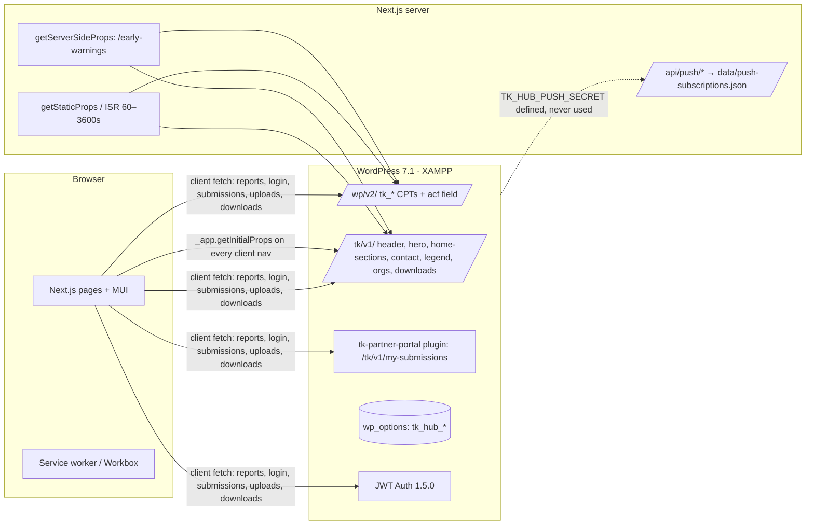

# Karamoja Climate Hub — System Audit Report (v2)

**Scope:** Next.js frontend (`C:\projects\karamoja-cluster-fe`, repo `SGGaita/turkana-karamoja`, branch `main`) and headless WordPress 7.1 backend (`C:\xampp\htdocs\karamoja-cluster-fe`)
**Stage:** Pre-launch
**Audience:** Development team
**Version:** v2 — full re-analysis, 25 Sep 2026. Supersedes v1 from the same day; see §13 for the changelog.

---

## 1. Executive summary

The platform works end to end:

- **Backend:** WordPress holds 8 custom post types and about 8 option-page settings groups, exposed through core REST plus a custom `tk/v1` namespace.
- **Frontend:** a Next.js 15.5 (Pages Router) app consumes that data, using ISR, PWA, Leaflet maps and a partner portal.

The code split between fetching (`lib/wordpress.js`) and mapping (`lib/wp-mappers.js`) is good. That will make the backend restructuring below cheap.

**It is not ready for production.** The re-analysis confirmed the v1 blockers and found deeper problems in five areas.

1. **Access control is broken end to end.** Approved partners get the WordPress `editor` role. Every approval and review action in wp-admin checks only `current_user_can('edit_post')`, which editors pass. So a partner can:
   - approve other organisations, which creates new editor accounts;
   - approve their own or anyone's alerts;
   - edit or delete all content.

   Rejecting an organisation does not take the role away.
2. **Workflow state is split across three parallel models.** There are two plugins, two organisation-status keys, two review-status keys, two approval buttons that grant *different roles*, and two meta writers that save the same field in different formats.
3. **The early-warning content is unsafe.**
   - A fake weather bar and fake "What's happening now" statistics appear as live data.
   - A sample RED flood alert auto-publishes on first boot.
   - Alerts never expire, because validity is stored as free text such as "Next 48 hours".
   - The map ignores the "publish on map" flag and guesses coordinates from words in the alert title.
   - The "active alerts" count includes every RED/ORANGE alert ever published.
4. **The CMS doesn't really control the frontend.**
   - About 45% of visible sections are hardcoded, including 8 of 9 page heroes.
   - The backend *restores* demo metrics and demo contacts when an editor clears them.
   - An init hook re-inserts a nav link on every request.
   - 3 of the 5 languages offered in the language picker are essentially untranslated.
5. **Terms-of-reference (ToR) obligations are unmet.** There is no analytics or Looker Studio integration, no per-county instances or county targeting of alerts, no backups, uptime or broken-link monitoring, no pen test, working PWA icons are missing, and the required roles (government editors, DRC staff) are not defined.

Most fixes are S/M. A focused **4–5 week** programme gets this to a defensible launch (§12).

### Scorecard

| Area | Rating | Headline |
|---|---|---|
| Security & access control | 🔴 Critical | Partners can approve orgs and content, edit everything, and keep access after rejection; unrestricted meta writes; PII exposed; secrets in source |
| Early-warning data integrity | 🔴 Critical | Fake live data, auto-seeded RED alert, no expiry, guessed map positions, inflated counts |
| Content management / headless readiness | 🟠 Weak | ~45% hardcoded; backend forces defaults; no section/taxonomy/i18n model |
| Architecture & code quality | 🟠 Weak | 3,591-line mu-plugin, duplicate plugins, 3 status models, 966 inline colours, no tests/lint |
| Performance & SEO | 🟡 Fair | ISR in place but defeated by `_app.getInitialProps`; no i18n routing, sitemap, canonical, analytics |
| Deployment, ops & ToR compliance | 🔴 Critical | File-based push store, no env separation, CI, backups or monitoring; several ToR items unaddressed |

---

## 2. System overview (as-is)



### Backend inventory

| File | Lines | Role |
|---|---|---|
| `mu-plugins/turkana-headless-hub.php` | 3,591 | CPTs, meta, CORS, 5 seeders, org approval + account provisioning, contact, 6 settings pages, REST |
| `mu-plugins/turkana-hub-i18n.php` | 943 | Locale resolution; Swahili overrides; tagline-only for tu/pk/ng |
| `mu-plugins/turkana-admin-alert-edit.php` / `-report-edit.php` | 615 / 563 | Custom edit screens and review status (`review_status`) |
| `mu-plugins/turkana-admin-cpt-lists.php` | 454 | List columns and approve/reject row actions |
| `mu-plugins/turkana-admin-dashboard.php`, `-community-initiatives.php`, `-content-edit-shared.php` | 789 | Dashboard, community-initiative posts, shared UI |
| `mu-plugins/turkana-partner-submissions.php` | 374 | Legacy submissions API (routes commented out, functions still loaded) |
| `mu-plugins/turkana-report-downloads.php` | 293 | Download counter |
| `plugins/tk-partner-portal/tk-partner-portal.php` | 846 | Registration/approval (`tk_partner` role) plus the `my-submissions` API |
| `plugins/jwt-authentication-for-wp-rest-api` | — | v1.5.0 |
| `plugins/mu-plugins.zip` | — | ⚠️ Web-accessible source archive |

### Frontend inventory

About 13.5k lines in total: 34 pages, 53 components, 25 lib modules and 6 docs modules.

Dependencies: Next 15.5.15, React 18, MUI 5, Leaflet/react-leaflet, Tiptap 3, `@ducanh2912/next-pwa`, and web-push. i18next, react-i18next and the language detector are installed but **unused**.

### What's done well (keep)

- **Fetch and map layers are separated.** Components receive normalised shapes.
- **ISR is used** with `revalidate`. URLs use SEO-friendly `slug-id` paths with canonical 308 redirects (`lib/slug.js`), and pages show `apiStale` banners.
- **The partner portal has a real review state machine** (pending, rejected, approved, withdrawal_requested, withdrawn).
  - The plugin forces **new** REST submissions to `pending` (`tk-partner-portal.php` `rest_pre_insert_*`).
  - It checks that `my-submissions` items belong to the user's organisation (`tk_pp_authorize_submission`).
- **wp-admin forms are validated.** Settings use `register_setting` with sanitize callbacks. Admin forms use nonces. Admin edit screens run alert/report HTML through `wp_kses`.
- **Download tracking is protected.** It has a per-IP cooldown and checks that the file belongs to the report.
- **The client uses good defaults.** Uploads have extension and size checks (10 MB, 5 files). Share popups open with `noopener,noreferrer`. Leaflet is dynamically imported.

---

## 3. Terms-of-reference compliance

Source: `planning/tor.md` (DRC CT Consultancy 01).

| ToR requirement | Status | Evidence / gap |
|---|---|---|
| Headless WordPress + Next.js | ✅ | As built |
| Mobile-first, responsive | ✅ | MUI responsive `sx` throughout |
| Core Web Vitals | 🟠 | LCP hero uses a raw ``; 7 font weights; 1.6 MB GeoJSON; client-rendered reports (§9) |
| DRC + county branding | 🟠 | DRC logo SVG present; branding hardcoded in `lib/branding.js`; no county themes |
| PWA: offline browsing | 🟠 | Workbox configured, but the 192/512 icons are **69-byte placeholders**, so installation fails; no offline page |
| PWA: push notifications | 🔴 | File-based store; WP never triggers a broadcast; no county targeting |
| Social media (Facebook, LinkedIn, Twitter) | 🟠 | Share buttons exist; profile URLs empty; footer social links `href="#"` |
| Simple CRUD for editors | 🟠 | Custom admin screens exist, but the section content model is missing (§6) |
| Roles: admins, **government editors**, **DRC staff** | 🔴 | Only `administrator` plus partners as `editor` (or `tk_partner`); no gov/DRC roles |
| Content: alerts, EWS, documents, county updates | 🟠 | Present; "county-specific updates" lack a county taxonomy |
| **Multi-instance: 3 cloned deployments (Turkana, Pokot, Moroto)** | 🔴 / ❓ | Built as one cross-border hub covering 5 areas. **Confirm with DRC** whether a single hub with county filtering is accepted; if not, instance config (branding, region, feed) must be parameterised |
| **Analytics: Google / Looker Studio** (sessions, downloads, popular pages) | 🔴 | No GA4/GTM or any analytics; download counts exist only in WP meta |
| Penetration test before go-live | 🔴 | Not done; the §4 findings would fail one |
| Automated backups | 🔴 | None configured |
| Uptime monitoring + rollback | 🔴 | None |
| Broken-link detection | 🔴 | None (the footer already has dead `#` links) |
| SEO (optimisation, submission, ranking reports) | 🔴 | No sitemap, robots, canonical, `hreflang`, Search Console |
| Interactive maps | ✅ | Leaflet maps for coverage, advisories and services |
| Government content portal | 🟠 | Partner portal works; security model must be fixed first |
| Targeted EWS by county | 🔴 | No region taxonomy on alerts; push not segmented |

---

## 4. Launch blockers (P0)

| # | Issue | Evidence | Fix | Effort |
|---|---|---|---|---|
| P0-1 | **Partner privilege escalation.** Approved partners become `editor` (`turkana-headless-hub.php:1606, 1624`). Every approve/reject path checks only `edit_post`: org approval `tk_org_set_status` (:1687), bulk approve (:1848), metabox status change (:2107), content approve/reject (`turkana-admin-cpt-lists.php:88–117`), plugin decisions (`tk-partner-portal.php:715, 763`). So a partner can **approve new orgs (minting editor accounts), approve alerts, and edit or delete all posts and pages** with `unfiltered_html` | See Evidence column | `tk_partner` role with CPT-specific caps and `map_meta_cap` ownership; new `tk_reviewer`/`manage_tk_reviews` capability required by every approval path | M |
| P0-2 | **No revocation.** Rejecting an org only drafts the post; the linked user keeps the editor role and its JWT stays valid for up to 7 days | `tk_org_set_status` | On reject/suspend: downgrade role, clear `tk_org_id`, rotate sessions (`WP_Session_Tokens::destroy_all`), reject JWTs by user status | S |
| P0-3 | **Review bypass on update.** New submissions are forced to `pending`, but `PUT /wp/v2/tk_alert/{id}` with `status: publish` is accepted for editors. Approved reports stay partner-editable and new documents on live reports go public **without re-review** | `tk-partner-portal.php:376, 483` | Strip `publish_*` from partners; re-queue approved items on material edits, or version edits as pending revisions | S |
| P0-4 | **Unrestricted meta writes** via `acf`: any key, any value, no sanitising, on 9 post types incl. `post` | `turkana-headless-hub.php:440–472` | Per-CPT allowlist and typed sanitizers; drop `organization_id`, status and count keys from client input | S |
| P0-5 | **Fake data shown as live.** Weather bar (`WarningsStrip.js:43` ← `fallback-data.js:447`); hero "What's happening now" metrics (38°C, "3 warnings active", 2.4M reached, High hunger risk) in WP defaults, **re-applied when emptied** (`turkana-headless-hub.php:2417–2461`) and again by the frontend (`wordpress.js getHero`) | See Evidence column | Remove; compute "warnings active" from live alerts; other metrics CMS-managed with an as-of date and allowed to be empty | S |
| P0-6 | **Production fallbacks fabricate content** (reports, health alerts, orgs, contacts with `XXX` phones and `tkclimate.org` emails) when WP is unreachable; backend also restores demo contacts when an editor empties them | `lib/wordpress.js`; `tk_hub_get_contact` | Throw in prod `getStaticProps` so ISR keeps the last good page; backend: empty means empty | S |
| P0-7 | **Seeders run on `init` in prod**: sample RED "Flash Flood Warning — Turkwel River", demo programmes/services, About page, nav link re-inserted **every request** (:720–734) | `turkana-headless-hub.php:474–766` | WP-CLI `wp karamoja seed --demo` for dev only; delete seeded records | S |
| P0-8 | **Alerts never expire and are mis-positioned.** Validity is saved as a display string ("Next 48 hours", `advisory-validity.js`), so there is no end date. `publish_on_map` is mapped but **never used**; any alert whose title or area text matches a place name is plotted, via hardcoded alias coordinates (`wp-mappers.js:185–234`). Active count includes all historical RED/ORANGE | See Evidence column | Store `valid_from`/`valid_to` datetimes; filter expired server-side; respect `publish_on_map`; require explicit coordinates or a region term | M |
| P0-9 | **Demo login** `your-email@domian.com / admin123` in the bundle **and shown in the UI**; demo auto-approve registration when WP URL unset | `partners-stakeholders.js:170, 193, 225`; `OrgRegistrationForm.js:55` | Delete | S |
| P0-10 | **Org PII public**: contact email, name, phone, `wp_user_id`, `reviewed_by` via `/wp/v2/tk_organization` (meta + acf) and `/tk/v1/organizations/{id}`; the frontend displays contact name and email; the registration form gives no notice or consent (Kenya DPA 2019 / Uganda DPPA 2019) | `turkana-headless-hub.php:162–178, 344–354`; `organizations/[slug].js:66–72` | Public/private field split; explicit "public contact" field; privacy notice and policy page | S |
| P0-11 | **Secrets/env hardcoded**: `TK_HUB_PUSH_SECRET`, localhost CORS and Next URL, committed in the FE repo (`wordpress-plugin/mu-plugins-live/`) | `turkana-headless-hub.php:14–16` | `wp-config.php` via env; **rotate** push secret, VAPID private key, CARTO key, JWT secret | S |
| P0-12 | `wp-content/plugins/mu-plugins.zip` is web-downloadable; `wp-content/debug.log` is web-accessible with paths and stack traces | File system | Delete; move log outside web root | S |
| P0-13 | **Push store on local disk** (`data/push-subscriptions.json`): breaks on serverless or read-only hosts, is lost on redeploy, races, accepts unbounded unauthenticated writes | `pages/api/push/*.js` | DB table; validate; rate-limit; add region to subscription | M |
| P0-14 | Prod config: `WP_DEBUG` true; DB `root` with empty password; no `DISALLOW_FILE_EDIT`, `FORCE_SSL_ADMIN` or `WP_ENVIRONMENT_TYPE` | `wp-config.php` | §10.2 block | S |
| P0-15 | PWA icons are 69-byte placeholders; push notifications use the same icon; install prompts fail | `public/icons/*` | Real 192/512 and maskable icons; badge icon | S |

---

## 5. Security & access control

### 5.1 Three parallel workflow models (root cause of most access bugs)

| Concern | mu-plugin (`turkana-headless-hub.php`) | Admin screens (`turkana-admin-*.php`) | Plugin (`tk-partner-portal.php`) |
|---|---|---|---|
| Org status key | `verification_status` | — | `_tk_org_status` (+ writes `verification_status`) |
| User ↔ org link | post meta `wp_user_id` | — | user meta `_tk_org_id`, post meta `_tk_org_user_id` |
| Role on approval | **`editor`** | — | `tk_partner` (`read` only) |
| Approval UI | Row action, bulk action, metabox | — | Separate row action |
| Content review key | — | `review_status` | `_tk_review_status` |
| `register-organization` / `organization-status` routes | ✅ Win (mu-plugins hook first) | — | Shadowed (dead) |
| Org post status on register | `draft` | — | `pending` |

What goes wrong as a result:

- An administrator can approve the same organisation with two different buttons that grant **different roles**.
- An organisation approved through the mu-plugin keeps `_tk_org_status = pending` in the plugin's list column.
- `organization-status` returns the mu-plugin's view of status, while `my-submissions` uses the plugin's user link.
- Reference numbers differ between the two paths (`ORG-12` vs `TK-ORG-000012`).

**Fix:** one plugin, one state machine:

- `tk_org_status` ∈ {pending, approved, suspended, rejected}
- `tk_review_status` ∈ {draft, pending, approved, rejected, withdrawal_requested, withdrawn}
- one user↔org link (`tk_org_id` user meta)

Migrate existing meta with a one-off WP-CLI script.

### 5.2 Target role and capability model

| Role | Capabilities |
|---|---|
| `tk_partner` (org publisher) | `read`, `upload_files` (restricted MIME), `edit_tk_alerts`, `edit_tk_reports` for **own org only** (via `map_meta_cap`), no `publish_*`, no `edit_others_*`, no `unfiltered_html`, no access to `post`/`page` |
| `tk_gov_editor` (ToR) | As partner, plus `publish_tk_alerts` for their county region |
| `tk_reviewer` / DRC staff (ToR) | `publish_*`, `edit_others_*` on hub CPTs, `manage_tk_reviews`, `manage_tk_orgs` |
| `administrator` | Settings and users |

Register every CPT with `capability_type => ['tk_alert','tk_alerts'], map_meta_cap => true`. Every approve/reject handler must check `manage_tk_reviews` / `manage_tk_orgs`, not `edit_post`.

### 5.3 Input handling & XSS

- **REST writes** (`tk_save_acf_meta`, P0-4) and the plugin's `tk_pp_stamp_new_submission` both run on `rest_after_insert_tk_alert/report` and save the same keys in different shapes:
  - `keywords`: comma string vs array;
  - `report_files`: JSON string vs serialized array.

  This already caused the fatal `json_decode(): Argument #1 must be of type string, array given` in `debug.log`.
- **Admin screens sanitise with `wp_kses`, but REST writes of `body` do not.** Rich HTML reaches the frontend through `dangerouslySetInnerHTML` in `about.js:75`, `reports/[slug].js:160` and `community/[slug].js:107`. Sanitise on save (server) and on render (`sanitize-html` / `isomorphic-dompurify`).
- **Alert `body` is displayed as text.** It is Tiptap HTML, but `early-warnings/[slug].js:172` renders it as a plain string, so users see raw tags. It is also placed raw into `<meta name="description">` (line 53).
- **Settings hrefs accept `javascript:` URIs.** CTA and nav hrefs use `sanitize_text_field` (`tk_hub_sanitize_header`, `tk_hub_sanitize_hero_translations`), and hero `metrics` and `nav_links` are saved unsanitised. This is admin-only, so low risk, but it should use `esc_url_raw` with an allowlist of `/`, `https:`, `mailto:` and `tel:`.
- **Report documents** accept any external URL (`tk_pp_sanitize_files`), and the preview dialog iframes it (`ReportPreviewDialog.js:88`). Restrict to the WP media host, or to attachment IDs owned by the user.

### 5.4 Public endpoints abuse

| Endpoint | Risk | Mitigation |
|---|---|---|
| `POST tk/v1/register-organization` | Spam; admin email flood (plugin version mails the admin on each) | Turnstile/hCaptcha + IP rate limit |
| `GET tk/v1/organization-status?email=` | Email enumeration; leaks org name, ID and status for any email | Derive from the JWT user; drop the email parameter |
| `POST tk/v1/contact-submit` | Mail relay spam; message lost if mail fails | Captcha + rate limit; persist to a `tk_message` CPT |
| `POST /api/push/subscribe` | Unbounded disk writes | Validate endpoint host and keys; rate limit |
| `/wp/v2/users` | Lists partner usernames (derived from emails) | Restrict to authenticated users |
| `xmlrpc.php`, WP front-end, `?author=` | Brute force, enumeration, duplicate content (CPTs `public => true`, default themes installed) | Disable XML-RPC; `publicly_queryable => false`; redirect non-admin, non-REST traffic to Next |
| Topbar "API Access" link → `/help/technical#api-reference` | Invites third-party use of an unversioned, unthrottled API | Publish a read-only, cached, rate-limited `tk/v1` subset, or remove the link |

### 5.5 Auth & session (frontend)

- **JWT storage:** the JWT lives in `sessionStorage`, and the browser calls WP directly, so any XSS can steal it. Use the BFF pattern: Next `/api/auth/*` sets an `httpOnly; Secure; SameSite=Lax` cookie, and Next routes proxy authenticated calls to WP.
- **Portal gating is client-trusted:**
  - Which organisation is shown comes from an email in `sessionStorage` (`handleRegistered` sets it without login).
  - If the status call fails, the portal falls back to a cached `approved` record.
  - The server still enforces the JWT, so this doesn't expose data, but it misleads users. Derive the organisation from `/tk/v1/me`.
- **Token expiry:** there is no expiry or 401 handling (JWT TTL is 7 days).
- **CORS:**
  - `Access-Control-Allow-Credentials: true` is unnecessary.
  - The `OPTIONS` short-circuit runs for every request site-wide and reads `$_SERVER['REQUEST_METHOD']` without `isset`, which logs warnings under cron/CLI.

### 5.6 Security headers

Add in `next.config.js` `headers()`:

- `Content-Security-Policy` allowing CARTO, the WP media host and fonts
- HSTS
- `X-Content-Type-Options`
- `Referrer-Policy`
- `Permissions-Policy`
- `frame-ancestors 'none'`

---

## 6. Early-warning data integrity

This deserves its own section: in an EWS, a wrong or stale alert is itself a safety issue.

| # | Issue | Evidence | Fix |
|---|---|---|---|
| E1 | Validity is text, so alerts never expire; the list sorts by level, so a months-old RED stays at the top | `advisory-validity.js`; `wordpress.js getAlerts` | `valid_from`/`valid_to` datetime meta; "Active" = now within window; archive view for expired |
| E2 | "N Active Alerts" counts all RED/ORANGE ever published | `WarningsStrip.js` | Count only active window |
| E3 | Map ignores the `publish_on_map` flag; plots anything whose text matches a place | `wp-mappers.js:174, 203–236` | Respect the flag; require coordinates or a `tk_region` term |
| E4 | Location guessed from free text via hardcoded aliases (e.g. "karamoja" → Moroto coordinates) | `AREA_COORD_ALIASES`, `HUB_MAP_LOCATIONS` | Region taxonomy with canonical coordinates and geometry; picker writes explicit coordinates |
| E5 | Admin "approve" auto-enables `publish_on_map` when only `area` text exists | `turkana-admin-cpt-lists.php:97–103` | Only when coordinates or a region term exist |
| E6 | Seeded sample RED alert is published | §4 P0-7 | Delete |
| E7 | Push uses a fixed `tag: 'karamoja-alert'` with `renotify`, so a later GREEN notice **replaces** an unread RED on the device | `public/push-handler.js` | Tag per alert ID; severity in title; `requireInteraction` for RED |
| E8 | No targeting: subscriptions have no region; broadcast is all-or-nothing and never triggered | `api/push/*`, WP | Region on subscription; WP publish hook → broadcast for matching regions |
| E9 | Offline: Workbox `StaleWhileRevalidate` for all documents can show stale alert pages with no timestamp | `next.config.js` | NetworkFirst for alert pages; "Last updated" from data; offline page |
| E10 | No correction or retraction model (who issued, superseded-by, cancelled) | Data model | `status` ∈ {active, updated, cancelled}; `supersedes` link; audit trail |

---

## 7. Content management & headless architecture

**Goal:** every visible section is editable in WordPress, the current layout stays pixel-identical, and nothing is hardcoded in the frontend.

### 7.1 Section inventory

✅ = CMS-driven · ⚠️ = partial · ❌ = hardcoded in frontend

| Page / Section | Component | Current source | Status | Target backend source |
|---|---|---|---|---|
| Top bar, logo, nav | `Navbar` | `tk_hub_header` option or WP menu `tk-main-nav` | ⚠️ | Site Settings → Header + WP menu. Fix: submenus dropped; external URLs broken by `tk_hub_menu_path` (keeps path only); About link force-inserted |
| Branding/SEO title & description | `lib/branding.js`, `Layout` | JS constants; `wp-mappers.js:8–29` **overrides** CMS titles via `LEGACY_TITLES` | ❌ | Site Settings → Branding & SEO |
| Urgent banner | `Navbar` | Derived from alerts | ✅ | (Use active window, E1) |
| Hero | `Hero` | `tk_hub_hero` (en/sw) | ⚠️ | Home → Hero block. Metrics must be live or optional (P0-5) |
| Page heroes: Early Warnings, Reports, Community + 4 sub-pages, Organizations | `PageHero` | Hardcoded title, subtitle and **Unsplash** image in 8 pages | ❌ | Per-page hero fields |
| About intro (home + About) | `AboutHubIntro` | `lib/about-hub-content.js` incl. Unsplash image | ❌ | "Intro" block (reusable) |
| Commissioned by | `CommissionedBySection` | `lib/about-hub-content.js` | ❌ | About → "Commissioned by" block + logo |
| Geographic coverage + legend | `GeographicCoverageSection`, `ClusterCoverageMap` | `lib/regions.js`, `lib/cluster-coverage.js` | ❌ | `tk_region` taxonomy |
| Key features / How it works | `KeyFeaturesCards`, `HowItWorksStepper` | **Regex-parsed from About HTML** (`about-content.js:88, 149`) + defaults | ⚠️ fragile | Repeater blocks |
| Map section copy | `MapSection` | `home-sections` + `COVERAGE_NARRATIVE` | ⚠️ | Home → Map block |
| Map marker positions | `wp-mappers.js`, `hub-locations.js` | Hardcoded alias table | ❌ | Region/location terms (E3–E4) |
| Warnings strip heading | `WarningsStrip` | Hardcoded English | ❌ | Home → Alerts block |
| Weather bar | `WarningsStrip` | **Fake constants** | ❌ | Real feed or remove |
| Initiatives | `InitiativesSection` | Posts in `community-initiatives` category (demo fallback) | ✅/⚠️ | Keep; drop prod fallback |
| Get involved | `GetInvolvedSection` | `home-sections`; CTA href hardcoded | ⚠️ | CTA block (label + URL) |
| Footer text/columns | `Footer` | `home-sections.footer`; links are **labels only** (`href="#"`) | ⚠️ | WP menus `footer-1..3` |
| Footer partner chips / regions | `Footer.js:6`, `FOOTER_REGIONS` | Hardcoded | ❌ | Featured orgs; `tk_region` |
| Alerts list/detail, legend | pages, `AlertLevelLegend` | CPT + option | ✅ | + `tk_hazard`, `tk_region` |
| Reports library | `pages/reports.js` | CPT (client-side fetch) | ✅ | SSG; taxonomies below |
| Report categories/countries/keywords/target groups | `report-categories.js`, `countries.js`, `advisory-constants.js`, `report-keywords.js` | Hardcoded lists → free-text meta | ❌ | Taxonomies |
| Community page (outreach, radio) | `pages/community.js` | `tk_hub_community_page` | ✅ | Blocks |
| Water points / assistance / planting | sub-pages | CPTs; type/status enums hardcoded | ⚠️ | Taxonomies with colour/icon term meta |
| Seasonal outlook | `planting-calendar.js:34` | Constant | ❌ | `tk_seasonal_outlook` CPT |
| Organisations directory | `organizations/index.js` | CPT; `organizationPortals`, `partnerTypeColors` hardcoded | ⚠️ | Block + `tk_org_type` |
| Contact | `pages/contact.js` | `tk_hub_contact` (backend restores demo rows when emptied) | ⚠️ | Keep; "empty means empty" |
| Help / FAQ / guides | `pages/help/*`, `lib/docs/*` | Hardcoded JS (duplicated in `docs/*.md`) | ❌ | WP pages + `tk_faq` |
| Portal UI copy, forms, empty states, errors | many | Hardcoded English | ❌ | UI strings dictionary (§7.4) |
| Images | 25 Unsplash URLs | Hotlinked, non-DRC imagery | ❌ | WP Media Library only |
| Privacy policy / terms | — | Missing | ❌ | WP pages |

### 7.2 Target content model

```
Global
 └─ Site Settings (one cached endpoint)
     branding · SEO defaults · social · header/topbar · footer menus · emergency contacts · feature flags · analytics IDs

Pages (WP "page" + typed section blocks)  ← preserves current layout
 └─ home · about · community (+4) · early-warnings · reports · organizations · contact · help/* · privacy

Collections (CPTs)
 tk_alert · tk_report · tk_organization · tk_programme · tk_water_point
 tk_assistance_site · tk_planting_advisory · tk_seasonal_outlook* · tk_faq* · tk_message*

Taxonomies*
 tk_country → tk_region (hierarchical; term meta: lat, lng, colour, order, geojson_key)
 tk_hazard · tk_report_category · tk_keyword · tk_target_group · tk_org_type (colour)
 tk_water_point_type · tk_site_type · tk_crop

UI strings*
 tk_hub_strings option keyed by locale → i18next resources
```
`*` = new

### 7.3 Section registry pattern (layout preserved)

`GET /wp-json/tk/v1/pages/home?lang=sw` returns ordered, typed sections:

```json
{
  "slug": "home",
  "seo": { "title": "...", "description": "...", "image": "https://cms.../og.jpg" },
  "sections": [
    { "type": "hero", "id": "s1", "data": { "eyebrow": "...", "title": "...", "backgroundImage": {"url":"...","alt":"..."}, "primaryCta": {"label":"...","href":"/early-warnings"}, "metrics": [] } },
    { "type": "intro", "id": "s2", "data": { "eyebrow": "...", "titleLine1": "...", "body": "<p>...</p>", "image": {...}, "highlights": [...] } },
    { "type": "alerts_map", "id": "s3", "data": { "eyebrow": "...", "title": "...", "subtitle": "..." } },
    { "type": "alerts_strip", "id": "s4", "data": { "eyebrow": "Early Warning System", "title": "Active Climate Alerts", "limit": 4 } },
    { "type": "initiatives", "id": "s5", "data": { "title": "...", "limit": 3 } },
    { "type": "cta", "id": "s6", "data": { "eyebrow": "...", "heading": "...", "body": "...", "button": {"label":"...","href":"/partners-stakeholders"} } }
  ]
}
```

```js
// components/sections/registry.js
import Hero from '../Hero';
import AboutHubIntro from '../AboutHubIntro';
import MapSection from '../MapSection';
import WarningsStrip from '../WarningsStrip';
import InitiativesSection from '../InitiativesSection';
import GetInvolvedSection from '../GetInvolvedSection';

export const SECTION_COMPONENTS = {
  hero: Hero,
  intro: AboutHubIntro,
  alerts_map: MapSection,
  alerts_strip: WarningsStrip,
  initiatives: InitiativesSection,
  cta: GetInvolvedSection,
};

export function SectionRenderer({ sections, context }) {
  return sections.map((s) => {
    const C = SECTION_COMPONENTS[s.type];
    if (!C) return null; // unknown types never break the page
    return <C key={s.id} {...s.data} {...context} />;
  });
}
```

Components switch from importing constants or contexts to receiving props. JSX and `sx` are unchanged.

| Backend option | Pros | Cons | Recommendation |
|---|---|---|---|
| **A. ACF Pro Flexible Content** + a stable JSON shaper | Fastest; good editor UX; repeaters, images | Paid licence | ✅ Pre-launch |
| B. Custom Gutenberg blocks (`block.json`) → `parse_blocks()` | No licence; native editor | More build time | Long-term |
| C. Keep extending option pages | No new deps | No ordering; custom PHP UI per section; already 6 pages | ❌ Stop |

Whichever option you pick, **the frontend never reads raw ACF or block markup**. It only reads the documented `tk/v1/pages/{slug}` schema.

### 7.4 Multilingual (en, sw, tu, pk, ng)

**Current state**

- The language picker offers 5 languages. Choosing Turkana, Pokot or Ngakarimojong changes **only the tagline**.
- Swahili covers the header, hero and home sections only. Page heroes, alerts, reports and UI strings stay English.
- `_app.js` and `index.js` fetch `en`/`sw` only.
- The locale is a client cookie, so the SSG HTML is always English and swaps after hydration: a flash of English, no indexable translations, no `hreflang`, and `<Html lang="en">` is fixed.
- i18next is installed but unused (`lib/i18n/` is empty).
- Planning docs specify different locale codes (`tkn`, `kj`) and a Postgres CMS that was not built (`planning/i18n-multilanguage-ffadf4.md`).

**Target**

1. Next i18n routing: `locales: ['en','sw','tu','pk','ng']`. `getStaticProps({ locale })` passes `?lang=`. Per-locale HTML, `hreflang` and the correct `lang` attribute.
2. Content translation: Polylang (REST-aware) for pages, CPTs and terms, or custom `_translations` meta. Alerts need at least `title`, `body` and `actions` translated.
3. UI strings: `tk_hub_strings` edited in wp-admin as a key × locale grid, served at `/tk/v1/strings?lang=` and loaded into i18next at build. Missing keys fall back to `en`.
4. **Only list a language in the picker once its coverage passes a threshold.** Show translation completeness in admin.

### 7.5 Editorial workflow & freshness

- **On-demand revalidation:** publish/update/option-save hooks call Next `POST /api/revalidate` with a secret and affected paths. This replaces 60–3,600 s staleness and removes the need for SSR on `/early-warnings`.
- **Push:** the publish hook for RED/ORANGE alerts (after review) calls broadcast for the alert's regions (E8).
- **Preview:** Next Draft Mode for pending items, so reviewers see the real layout.
- **Audit trail:** `reviewed_by`/`reviewed_at` on alerts and reports (today only on orgs); log role changes.
- **Stop the CMS from fighting editors:**
  - remove the "empty → defaults" restoration (hero metrics, contact rows);
  - remove the forced About nav insertion (`turkana-headless-hub.php:716–734`);
  - remove the `LEGACY_TITLES` override.

### 7.6 Backend data-structure fixes

- **Typed meta:** register with real types and schemas (arrays, numbers, datetimes) instead of JSON-in-string (`report_files`, `advisory_files`, `post_files`, `actions`).
- **Coordinates:** use `number` with bounding-box validation.
- **`organization_id`:** make it an integer set server-side only.
  - Replace fuzzy `stripos` org↔content matching (`tk_content_belongs_to_org`; an abbreviation like "UN" matches everything) with a `meta_query`.
  - `tk_org_collect_profile_data` loads 100 reports + 100 alerts and filters in PHP. Replace with a paginated query.
- **Download counters:** read-modify-write on post meta is racy. Use a custom table or an atomic `UPDATE`, and store hashed IPs.
- **Save hooks:** `tk_alert_save_meta` calls `wp_update_post` inside `save_post_tk_alert` (re-entry). Guard with `remove_action`/flags.
- **Duplicate registration:** remove the defensive CPT registration in the plugin, which masks configuration errors.

---

## 8. Backend code quality

| Issue | Evidence | Recommendation |
|---|---|---|
| God file | `turkana-headless-hub.php`: 3,591 lines, 12+ concerns | One `karamoja-core` plugin with PSR-4 classes: `PostTypes`, `Taxonomies`, `Meta`, `Rest\*Controller extends WP_REST_Controller`, `Admin\*`, `Settings\*`, `Cli\*` |
| Duplicate/dead code | Legacy `turkana-partner-submissions.php`; duplicated org workflow; shadowed routes | Delete and merge (§5.1) |
| Logic in mu-plugins | Cannot be deactivated, versioned or updated cleanly | mu-plugin as a thin loader only |
| Source-of-truth drift | Repo copy `wordpress-plugin/mu-plugins-live/` has 3 of 9 assets; WP code deployed by hand-copy | Separate `karamoja-wp` repo; CI deploy |
| Init-time seeding | 5 seeders + 2 option writers on every `init` | WP-CLI + activation hook |
| Inline HTML/CSS in PHP | Large echoed admin UIs | `/views` templates; per-screen enqueues |
| No standards/tests | — | WPCS (PHPCS), PHPStan L5, PHPUnit for REST controllers and permission callbacks |
| Text domains | `turkana-headless` vs `tk-partner-portal` | One domain |
| Runtime errors | Fatal `json_decode` (partner submissions); undefined `REQUEST_METHOD`; 100× DB connect failures | Type fixes; guards; health endpoint |

---

## 9. Frontend architecture, performance & quality

### 9.1 Data fetching

| Issue | Where | Impact | Fix |
|---|---|---|---|
| `MyApp.getInitialProps` fetches 5 headers + 2 home payloads | `pages/_app.js` | Disables static optimisation for pages without data methods; **re-runs in the browser on every navigation** (7 WP calls per click, CORS-dependent) | Remove; `getGlobalProps(locale)` in each page's `getStaticProps` |
| `/early-warnings` uses `getServerSideProps` | `early-warnings/index.js:185` | 3 WP calls per request, and traffic spikes happen during emergencies | ISR 30 s + on-demand revalidation |
| Same alerts endpoint fetched 2–3× | `getAlerts`, `getMapAdvisories`, `getHealthAlerts` | Wasted WP load | Fetch once, derive |
| Reports library client-rendered | `pages/reports.js` | No crawlable HTML; slower LCP | SSG + client filtering |
| `per_page` 100/200 caps, no pagination | `lib/wordpress.js` | Silent truncation | Loop on `X-WP-TotalPages`; `_fields` |
| No fetch timeout | `fetchWp` | Hung builds/revalidations | `AbortSignal.timeout(8000)` + one retry |
| Errors hidden in prod | `fetchWithFallback` | Invisible failures | Sentry; throw (P0-6) |
| Org slug resolution fetches the full org list per page | `organizations/[slug].js:177` | N×100 fetch at build | Slug field in WP; lookup by slug |

### 9.2 Performance

| Item | Current | Target |
|---|---|---|
| LCP hero image | Raw ``; only 3 files use `next/image` | `next/image` with `priority` and `sizes`; WP sizes |
| Fonts | Google CSS link, 7 Montserrat weights | `next/font` with 3–4 weights |
| GeoJSON | 1.6 MB fetched by coverage map | mapshaper → TopoJSON; cache headers |
| Maps | Dynamic import ✅ | Also lazy-mount below the fold |
| Payloads | `_embed` everywhere | `_fields` whitelist |
| WP | No object/page cache | Redis object cache; short-TTL cache on `tk/v1` GETs, purged on save |

### 9.3 SEO

- **Missing:**
  - `sitemap.xml`
  - `robots.txt`
  - canonical tags
  - `og:image` / Twitter cards
  - `hreflang`
  - structured data (`SpecialAnnouncement` for alerts, `Report`, `Organization`)
  - Search Console
- **Also wrong:** `og:type="article"` everywhere; `lang` is fixed.
- **Custom error pages:** there is no custom `404`/`500` page.
- **WordPress front-end** duplicates content on the CMS domain. Lock it down and mark it `noindex`.

### 9.4 Structure & maintainability

- **Inline colours:** 966 hex literals across 72 files despite `theme.js`. Move them to palette tokens.
- **Oversized files:** `partners-stakeholders.js` (451 lines), `PartnerSubmissionsPanel` (401) and `early-warnings/[slug].js` (374). Split into feature folders with hooks.
- **Duplication:** `readSubs`/`writeSubs` ×3; upload loop ×2.
- **Client-side legacy redirects** (`dashboard.js`, `submit.js`, `contact-us.js`): move to `next.config.js` `redirects()`.
- **Dead code/files:** i18next deps, `.tmp-early-warnings.html`, `components/turkana-karamoja.code-workspace`, the old localhost image pattern.
- **Tooling gaps:** no ESLint, Prettier, tests, `.nvmrc` or `engines`. Add Vitest for `wp-mappers.js` (912 lines of pure functions — highest ROI) and Playwright smoke tests.
- **Documentation drift:** `planning/*` describes an unbuilt Python/Postgres CMS and different locale codes. `docs/*.md` duplicates `lib/docs/*.js`. Keep one source.

### 9.5 Accessibility

- **Colour-only severity:** add icons and `aria-label`s.
- **Contrast:** `#9A9A9A` on `#3D2B1F` fails WCAG AA for small text.
- **Dead links:** `href="#"` footer links. Maps need a text-list alternative.
- **Offline indicator:** `OfflineIndicator` is missing on the home page, which doesn't use `Layout`.

---

## 10. Deployment & operations

### 10.1 Environments & configuration

| Setting | Current | Production |
|---|---|---|
| WP URLs, CORS, push/revalidate secrets | Hardcoded localhost/secret | `wp-config.php` constants from env |
| Debug | `WP_DEBUG=true`; log in web root | Off; log outside web root; `WP_ENVIRONMENT_TYPE=production` |
| DB | `root`, empty password | Least-privilege user, strong password |
| Hardening | — | `DISALLOW_FILE_EDIT`, `FORCE_SSL_ADMIN`, minor auto-updates, remove Hello Dolly, unused themes and Akismet; limit login attempts; admin 2FA |
| Secrets | In source | Secret manager/env; rotate everything that has lived in files |
| CARTO key | Public by design | Restrict by HTTP referrer in the CARTO dashboard |

### 10.2 Production `wp-config.php` block

```php
define('WP_ENVIRONMENT_TYPE', 'production');
define('WP_DEBUG', false);
define('WP_DEBUG_LOG', '/var/log/wordpress/karamoja.log');
define('DISALLOW_FILE_EDIT', true);
define('FORCE_SSL_ADMIN', true);
define('WP_AUTO_UPDATE_CORE', 'minor');

define('JWT_AUTH_SECRET_KEY',  getenv('JWT_AUTH_SECRET_KEY'));
define('TK_HUB_CORS_ORIGINS',  getenv('TK_HUB_CORS_ORIGINS'));   // https://www.karamoja.org
define('TK_HUB_NEXT_URL',      getenv('TK_HUB_NEXT_URL'));
define('TK_HUB_PUSH_SECRET',   getenv('TK_HUB_PUSH_SECRET'));
define('TK_REVALIDATE_SECRET', getenv('TK_REVALIDATE_SECRET'));
```

### 10.3 Topology

```
cms.karamoja.org  (WordPress 7.1, PHP 8.2+, MariaDB 10.6+, Redis, HTTPS, WAF, admin 2FA, noindex)
        │  REST (server-to-server for SSG/ISR; browser only via Next BFF)
        ▼
www.karamoja.org  (Next.js on Node 20 / Vercel + CDN)
        │  /api/revalidate  ◄── WP publish hooks
        │  /api/push/*      ──► DB table (region-aware subscriptions)
        │  GA4 / GTM        ──► Looker Studio (ToR)
```

`docs/hosting-requirements.md` says `data/` must be writable for push. Update it once push moves to a database.

### 10.4 CI/CD, backups, monitoring (ToR items)

- **Repos:** `karamoja-web` and `karamoja-wp` (plugin + mu-loader + composer). WP core is not in git.
- **CI:** lint → test → build against a staging WP → preview deploy. PHP: PHPCS, PHPStan, PHPUnit, then deploy.
- **Backups:** daily DB + weekly `uploads/`, off-site, 30-day retention, **tested restore**.
- **Monitoring:**
  - Sentry (Next + WP);
  - uptime checks on `/` and `/wp-json/tk/v1/site-header`;
  - alert if `apiStale` stays true for more than 15 min;
  - broken-link crawler (e.g. `linkinator` in CI plus a weekly scheduled run).
- **Analytics:**
  - GA4 via `next/script` with consent;
  - custom events for downloads, push opt-in and alert views;
  - Looker Studio dashboard (ToR §3.4).
- **Security:** third-party pen test after the P0 fixes, before go-live.
- **Email:** SMTP provider with SPF/DKIM. Approvals, password setup and the contact form depend on it.
- **Uploads:** MIME allowlist (PDF, DOCX, XLSX, images), server-side size cap, malware scan, optional S3/CDN offload.
- **Runbook:** issue, correct or retract an alert; on-call during rainy seasons.

---

## 11. Risk register (top 10)

| # | Risk | Likelihood | Impact | Mitigation |
|---|---|---|---|---|
| 1 | Partner publishes false or malicious alert | High (any partner can) | Severe (public safety, reputation) | P0-1/3/4 |
| 2 | Expired or mis-located alert drives wrong action | High | Severe | E1–E5 |
| 3 | Fake metrics or weather taken as real | Certain on launch | High | P0-5/6 |
| 4 | Account takeover via XSS → JWT theft | Medium | High | Sanitise, BFF cookie, CSP |
| 5 | PII exposure / data-protection complaint | High | Medium | P0-10 |
| 6 | Push system lost on redeploy | Certain on serverless | Medium | P0-13 |
| 7 | WP overload during an alert spike | Medium | High | ISR + on-demand revalidation + cache |
| 8 | Unrecoverable data loss | Medium | Severe | Backups + restore drill |
| 9 | ToR acceptance failure (analytics, pen test, multi-instance) | High | High | §3 items; confirm scope with DRC |
| 10 | Workflow drift between 3 status models | Certain | Medium | §5.1 consolidation |

---

## 12. Remediation roadmap

Effort: **S** ≤ 1 day · **M** 2–4 days · **L** 1–2 weeks (one developer)

### Phase 0 — Launch blockers (Week 1–1.5)

| # | Task | Refs | Effort |
|---|---|---|---|
| 1 | Remove demo login/auto-approve, fake weather, fake hero metrics; stop "empty → defaults"; prod fallbacks throw | P0-5/6/9 | S |
| 2 | Move seeders to WP-CLI; delete seeded RED alert and demo records; remove forced nav insertion | P0-7 | S |
| 3 | Meta allowlist + sanitizers; unify the two REST writers | P0-4, §5.3 | S |
| 4 | Roles and capabilities: `tk_partner`, `tk_gov_editor`, `tk_reviewer`; every approval path on review caps; revocation on reject | P0-1/2/3, §5.2 | M |
| 5 | Consolidate the org and review state machines into one plugin; migrate meta; delete the legacy file | §5.1 | M |
| 6 | Hide PII; privacy notice and policy page; restrict `/wp/v2/users`; disable XML-RPC; lock down WP front-end | P0-10, §5.4 | S |
| 7 | Secrets to env and rotate; delete `mu-plugins.zip`; prod `wp-config`; move debug log | P0-11/12/14 | S |
| 8 | Alert validity datetimes, expiry filtering, active counts, `publish_on_map` respected, explicit coordinates | P0-8, E1–E5 | M |
| 9 | Push to DB with regions; WP publish hook; per-alert tags; real icons | P0-13/15, E7–E8 | M |
| 10 | HTML sanitisation (server + client); restrict document URLs | §5.3 | S |

### Phase 1 — Content model & CMS coverage (Weeks 2–3)

| # | Task | Effort |
|---|---|---|
| 11 | Site Settings endpoint (branding, SEO, menus, partners, social, analytics IDs); remove `lib/branding.js` and `LEGACY_TITLES` | M |
| 12 | Taxonomies (`tk_region` with coordinates, categories, keywords, target groups, org type, service types) + migration | L |
| 13 | `tk/v1/pages/{slug}` sections (ACF Flexible Content) + `SectionRenderer`; migrate Home, About, 8 page heroes, Community, Organizations | L |
| 14 | Help/FAQ → WP; seasonal outlook CPT; privacy/terms pages | M |
| 15 | On-demand revalidation + Draft Mode preview | M |
| 16 | Typed meta schemas; org↔content by `organization_id` `meta_query`; atomic download counter | M |

### Phase 2 — Performance, SEO, i18n, ToR (Weeks 3–4)

| # | Task | Effort |
|---|---|---|
| 17 | Remove `_app.getInitialProps`; ISR for early warnings; dedupe fetches; pagination; timeouts; SSG reports | M |
| 18 | Next i18n routing, `hreflang`, UI strings endpoint + i18next, content translations; gate the language picker on coverage | L |
| 19 | `next/image`, `next/font`, GeoJSON optimisation | S |
| 20 | Sitemap, robots, canonical, OG, structured data, 404/500 pages, Search Console | S |
| 21 | GA4 + consent + events → Looker Studio | S |
| 22 | Security headers/CSP; BFF auth with httpOnly cookie | M |
| 23 | Decide multi-instance vs single hub with DRC; if multi, parameterise instance config | M–L |

### Phase 3 — Engineering foundation & go-live (Weeks 4–5, parallel)

| # | Task | Effort |
|---|---|---|
| 24 | Split the WP god-file into a PSR-4 plugin; `karamoja-wp` repo | L |
| 25 | ESLint/Prettier, Vitest (mappers), Playwright smoke tests; PHPCS/PHPStan/PHPUnit | M |
| 26 | CI/CD, staging, backups + restore drill, Sentry, uptime, broken-link checks | M |
| 27 | Theme tokens (remove 966 inline hex values); feature folders | M |
| 28 | Accessibility pass | S |
| 29 | **External pen test**, fix findings, go-live checklist | M |

---

## 13. Changelog v1 → v2

**Corrected**

- *v1 P0-3 said new submissions are not forced to pending.* In fact `tk-partner-portal.php` forces `pending` on **create**. The real bypasses are updates via `/wp/v2` by editors, edits to approved reports, and document additions without re-review (now P0-3).

**Escalated**

- Partner role issue (P0-1) now includes the **privilege-escalation chain**: partners can approve organisations and content in wp-admin.
- No-revocation gap added (P0-2).

**New findings**

- Three parallel workflow/status models and dual approval buttons with different roles (§5.1)
- Early-warning integrity section (§6): no expiry, ignored `publish_on_map`, guessed coordinates, inflated counts, push notification replacement, no targeting
- Backend restores demo hero metrics and contacts when editors empty them; forced nav insertion on every request; WP menu external links and submenus broken
- 8 page heroes hardcoded with Unsplash images; 25 Unsplash references; 966 inline hex colours in 72 files
- Language picker offers 3 effectively untranslated languages
- ToR compliance matrix (§3): analytics, multi-instance, pen test, backups, uptime, broken links, roles
- PWA icons are 69-byte placeholders
- No 404/500 pages
- No privacy policy or consent (data-protection exposure)
- Report document URLs unrestricted and iframed
- Client-trusted portal gating
- Unthrottled public "API Access"
- Planning and docs drift
- Risk register (§11)

**Verified unchanged:** all other v1 findings. The source is unchanged since v1 (file mtimes checked); the repo copy of the WP code matches live for the three main PHP files.

---

## 14. Appendix

### 14.1 REST endpoint inventory

| Method | Route | Auth | Notes |
|---|---|---|---|
| GET | `/wp/v2/tk_*` (8 CPTs) + `/wp/v2/posts` | Public | `acf` field; org PII exposed ⚠️ |
| POST/PUT/DELETE | `/wp/v2/tk_*`, `/wp/v2/posts`, `/wp/v2/pages`, `/wp/v2/media` | JWT | Editor role allows all ⚠️ |
| GET | `/tk/v1/site-header`, `/hero`, `/home-sections` | Public | `?lang=`; only `sw` substantive |
| GET | `/tk/v1/alert-legend`, `/community-page`, `/contact` | Public | Not localised |
| POST | `/tk/v1/contact-submit` | Public | No captcha, rate limit or persistence ⚠️ |
| POST | `/tk/v1/register-organization` | Public | Registered twice; mu wins ⚠️ |
| GET | `/tk/v1/organization-status?email=` | Public | Enumeration ⚠️ |
| GET | `/tk/v1/organizations/{id}` | Public | Contact PII ⚠️ |
| GET/PATCH/POST/DELETE | `/tk/v1/my-submissions/...` | Logged in | Ownership ✅; approved-report edits unreviewed ⚠️ |
| POST | `/tk/v1/reports/{id}/download` | Public | Cooldown ✅; racy counter |
| POST | `/jwt-auth/v1/token` | Public | No brute-force protection ⚠️ |
| POST | Next `/api/push/subscribe`, `/unsubscribe` | Public | File-based ⚠️ |
| POST | Next `/api/push/broadcast` | Shared secret | Never called ⚠️ |

### 14.2 Method

This is a static review of every source file in both folders:

- **Frontend:** 34 pages, 53 components, 31 lib/docs modules, config, PWA assets, planning and docs.
- **Backend:** 10 mu-plugins + assets, the `tk-partner-portal` plugin, the JWT plugin version, `wp-config.php`, `.htaccess`, `debug.log`, WP core version.
- **Cross-checks:** repo-vs-live WP code comparison, and the ToR in `planning/tor.md`.

Not inspected: database contents, live plugin activation state, runtime behaviour. Confirm in wp-admin which of the two approval paths is in use and whether `tk-partner-portal` is active. No secrets are reproduced in this report.
