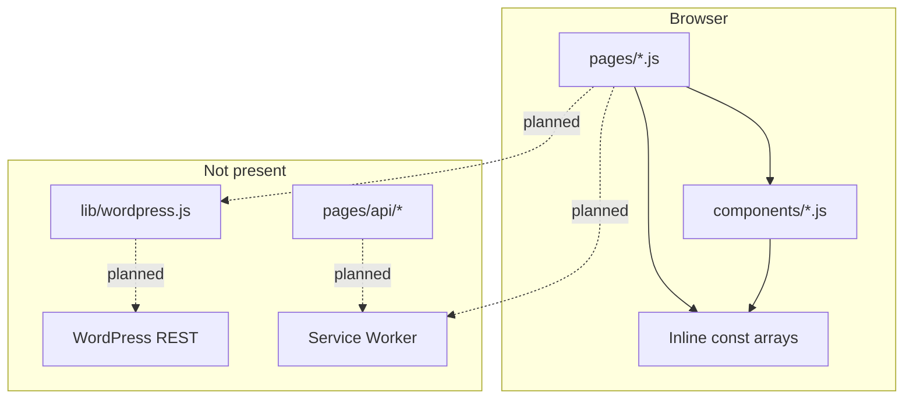

# Turkana–Karamoja Climate Hub — Current System Analysis

**Purpose:** Describe how the system works *today* before implementing the **TOR WP PWA alignment** plan (`tor_wp_pwa_alignment_0a0b7b25` in Cursor plans).  
**Audience:** DRC project team, implementers, WordPress operators.  
**Status:** Static UI prototype (v0.1.0) — no CMS, no PWA, no server data layer.  
**Related docs:** [TOR analysis](tor.md) · [WordPress REST integration](wordpress-rest-api-integration-ffadf4.md)

---

## 1. Executive summary

The repository contains a **Next.js 15 (Pages Router) front-end prototype** for the DRC Climate Change Knowledge & Information Hub. It delivers a mobile-first, MUI-themed experience across six routes plus a composite home page. All climate content—alerts, reports, initiatives, organizations, programmes, and news—is **hardcoded in JavaScript** inside page and component files. There is **no backend**, **no WordPress connection**, **no authentication**, **no progressive web app**, and **no analytics or ops tooling**.

The prototype is a strong **UX and visual baseline**: layout, alert severity styling, government submit form, Leaflet map, and cross-border branding are in place. The next phase (per alignment plan) adds headless WordPress as the system of record, Next.js data fetching (GSSP/GSP/ISR), JWT advisory submission, PWA offline caching, and Web Push for published alerts—without changing the visible design system.

| Dimension | Current | Contract target (TOR + integration spec) |
|-----------|---------|------------------------------------------|
| CMS | None (inline mocks) | Headless WordPress + REST |
| Data freshness | Fixed at build/dev time | ISR + always-fresh alerts (GSSP) |
| Government submit | Fake reference number | JWT → draft `tk_alert` in WP |
| Offline / push | Not implemented | PWA + VAPID push on publish |
| Deployments | Single codebase | 3 cloned instances (deferred) |
| Alt stack | Documented only | Postgres/Python CMS **out of scope** |

---

## 2. Technology stack

| Layer | Choice | Notes |
|-------|--------|-------|
| Framework | Next.js **15.3** (Pages Router) | No App Router; no `getStaticProps` / `getServerSideProps` anywhere yet |
| UI | React 18 + **MUI 5** + Emotion | Central theme in `theme.js` (DRC-adjacent palette: terracotta `#C1440E`, earth `#3D2B1F`, sky `#2E7BB4`) |
| Maps | **Leaflet** + `react-leaflet` | Used in `RegionalMap.js` / `MapSection.js` |
| Images | `next/image` + Unsplash URLs | `next.config.js` allows `images.unsplash.com` only |
| Language | JavaScript only | No TypeScript per integration doc |
| Dependencies | No `web-push`, no PWA plugin, no fetch/CMS libs | Minimal `package.json` (dev/build/start only) |

**Build output:** Default Next static/SSR behaviour; all pages are effectively **client-rendered static content** because no page exports data-fetching functions.

---

## 3. Application architecture (as-is)



**Request path today:** User → Next.js route → React tree → read-only mock arrays → MUI render. No network calls for content.

---

## 4. Routes and responsibilities

| Route | File | Layout | Content source |
|-------|------|--------|----------------|
| `/` | `pages/index.js` | Custom shell (Navbar + sections, no `Layout`) | Section components each own mocks |
| `/early-warnings` | `pages/early-warnings.js` | `Layout` + `PageHero` | Large `alerts[]` + `seasonalOutlook` in page file |
| `/reports` | `pages/reports.js` | `Layout` | `reports[]`, `stats[]` in page |
| `/community` | `pages/community.js` | `Layout` | `services[]` (programmes), `bulletins[]` (news-like) |
| `/organizations` | `pages/organizations.js` | `Layout` | `portals[]`, `organizations[]` in page |
| `/submit` | `pages/submit.js` | `Layout` | Form UI only; submit generates random `TK-2026-####` |

**Global shell:** `pages/_app.js` wraps all routes in MUI `ThemeProvider` + `CssBaseline`. `pages/_document.js` loads fonts (Playfair Display, DM Sans, DM Mono).

**Navigation:** `components/Navbar.js` — six links matching the table above; active state via `useRouter`.

---

## 5. Component model

### 5.1 Home page composition

`pages/index.js` is a **pure composition** of presentational sections (no props, no data lifting):

| Section component | Role | Data location |
|-------------------|------|---------------|
| `Hero` | Landing hero | Internal/static copy |
| `ForecastStrip` | 7-day forecast strip | `forecast[]` in component |
| `ClimateHubSection` | Hub intro / CTAs | Internal |
| `MapSection` | Map wrapper | Delegates to `RegionalMap` |
| `WarningsStrip` | EWS preview + mini weather | `alerts[]`, `weatherItems[]` in component |
| `InitiativesSection` | Initiative cards | `initiatives[]` in component |
| `CommunitySection` | Programme teaser | `programmes[]` in component |
| `OrganizationsSection` | Org logos/links | `organizations[]` in component |
| `NewsSection` | News/bulletin cards | `news[]` in component |
| `Footer` | Links, partners | Static |

### 5.2 Shared layout components

| Component | Used by |
|-----------|---------|
| `Layout` | All inner pages (not home) — Navbar, `<main>`, Footer, default `<title>` |
| `PageHero` | Inner pages — title, subtitle, breadcrumb, hero image |
| `RegionalMap` | `MapSection` — station markers (static coordinates) |

### 5.3 Data duplication problem (important for refactor)

The same conceptual entities are **defined multiple times** with slightly different field names:

| Entity | Home component | Dedicated page | Shape differences |
|--------|----------------|----------------|-------------------|
| Alerts | `WarningsStrip` (`desc`, `valid`) | `early-warnings.js` (`body`, `actions[]`, `valid`) | Home uses shorter copy; full page has actions list |
| Initiatives | `InitiativesSection` | — | Page-level detail only on home |
| Programmes | `CommunitySection` | `community.js` `services[]` | Overlap in themes, not same arrays |
| Organizations | `OrganizationsSection` | `organizations.js` | Page adds portal cards |
| News | `NewsSection` | `community.js` `bulletins[]` | Similar purpose, different arrays |

**Implication for implementation:** Extract mocks to `lib/fallback-data.js`, introduce `lib/wp-mappers.js` with a **single** `mapAlert()` (etc.), and pass props into section components so home and `/early-warnings` stay consistent.

---

## 6. Implicit content model (prototype shapes)

These shapes mirror the planned WordPress CPTs and will become mapper targets.

### Alerts (EWS)

```text
level: 'RED' | 'ORANGE' | 'YELLOW' | 'GREEN'
color, bg, icon, title, area, body/desc, source, issued, valid, actions?: string[]
```

### Reports

```text
icon, iconBg, tag, tagColor, title, desc, orgs[], date, isNew?, isUpdated?, size
```

### Initiatives

```text
img, tag, tagColor, title, desc, link
```

### Organizations

```text
name, abbr, type, flag, url (home); page adds portal groupings
```

### Programmes / community services

```text
icon, title, desc, langs[], color
```

### News / bulletins

```text
icon, title, desc, tag, date, urgent?
```

### Submit form (client state)

```text
org, contact, type, level, region, validPeriod, title, content
```

Maps to planned `tk_alert` + ACF: `alert_level`, `area`, `body`, `actions`, `source`, dates — **not wired**.

---

## 7. Features present vs TOR

Cross-reference: [planning/tor.md](tor.md).

| TOR area | Requirement | Current state |
|----------|-------------|---------------|
| 3.1 Web | Mobile-first, responsive | **Met** — MUI breakpoints, drawer nav |
| 3.1 | Core Web Vitals | **Unmeasured** — no production build tuning yet |
| 3.1 | DRC + county branding | **Partial** — generic TK hub; assets/fonts placeholder |
| 3.1 | **PWA** offline + push | **Missing** |
| 3.1 | Social integration | **Missing** (no share widgets / OG beyond basic meta) |
| 3.2 | Headless WP + Next | **Missing** — frontend only |
| 3.2 | CRUD / roles | **Missing** — submit is cosmetic |
| 3.3 | 3 regional clones | **Missing** — single site copy |
| 3.4 | Looker Studio | **Missing** |
| 3.5 | Security / pen test / backups | **Out of app scope** — not started |
| 3.6 | SEO program | **Minimal** — per-page `<title>` / description only |
| 4.1 | Climate hub + downloads | **UI only** — Download buttons not linked to files |
| 4.2 | EWS alerts | **UI only** — static list |
| 4.3 | Offline access | **Missing** |
| 4.4 | Interactive maps | **Partial** — Leaflet with static stations |
| 4.5 | Government portal | **Partial** — `/submit` form + org page copy; no auth |

---

## 8. Content intentionally static in phase 1

Per alignment plan, these stay mock/local until a later climate-data phase:

| Asset | Location | Reason |
|-------|----------|--------|
| 7-day forecast | `ForecastStrip.js` | No KMD/UMA API in spec |
| Regional weather strip | `WarningsStrip.js` `weatherItems` | Same |
| Map stations / layers | `RegionalMap.js` | Not in WP CPT list |
| Seasonal outlook block | `early-warnings.js` | Options field or external API later |

---

## 9. Configuration and environment

| Item | Status |
|------|--------|
| `.env` / `.env.example` | **Absent** |
| `NEXT_PUBLIC_WP_BASE_URL` | **Not used** |
| `lib/` directory | **Does not exist** |
| `pages/api/` | **Does not exist** |
| `public/manifest.json` | **Does not exist** |
| WordPress host / CPTs / JWT | **Prerequisite** — see planned `planning/wordpress-setup-checklist.md` |

---

## 10. Security and data integrity (as-is)

- **No secrets** in repo; no API keys required to run locally.
- **Submit page:** Client-side only; no validation beyond HTML5 `required`; reference numbers are random and imply success without persistence.
- **No CORS, JWT, or role checks** — acceptable for prototype; must change before go-live.
- **External images:** Unsplash hotlinks — acceptable for demo; production should use WP media + `images.remotePatterns`.

---

## 11. Gap summary → alignment plan mapping

The alignment plan closes gaps in this order:

| Step | Delivers | Touches current system by… |
|------|----------|----------------------------|
| 1 | `wordpress-setup-checklist.md` | Unblocks real API; no app code |
| 2 | `lib/fallback-data.js` | Centralizes all inline mocks |
| 3 | `lib/wordpress.js`, `wp-mappers.js`, `.env.example` | Adds CMS client + env contract |
| 4 | GSSP/GSP/ISR on pages | Removes static-only pages; adds revalidate |
| 5 | Presentational section components | `index.js` fetches once, passes props |
| 6 | `submit.js` JWT + draft POST | Replaces fake ref numbers |
| 7 | PWA manifest + Serwist | Offline + installable |
| 8 | Push subscribe/broadcast APIs | EWS notification path |

**Explicitly deferred** (document only): three regional deployments, Looker Studio, pen test/ops, full SEO, i18n (en/sw/tkn/kj), FastAPI custom CMS.

---

## 12. Prerequisites before coding (checklist)

- [ ] WordPress instance with CPTs: `tk_alert`, `tk_report`, `tk_initiative`, `tk_organization`, `tk_programme`
- [ ] ACF fields + ACF to REST; sample `GET` responses verified
- [ ] CORS + JWT plugin; editor test accounts
- [ ] `NEXT_PUBLIC_WP_BASE_URL` for dev/staging
- [ ] Decision on push: WP webhook → `POST /api/push/broadcast` vs WP-only plugin
- [ ] VAPID key pair for push (staging/production)
- [ ] DRC/county logos and PWA icons (192/512) when available

---

## 13. Acceptance baseline (what “done” adds without visual regression)

When implementation completes, the same pages should look identical but behave as follows:

1. With WP URL set and API healthy → content from WordPress.  
2. With WP down or unset → `fallback-data` + optional “cached content” banner.  
3. `/early-warnings` updates on each request (GSSP).  
4. `/submit` creates a real draft `tk_alert` after editor login.  
5. Lighthouse PWA installable; subscribed clients receive test push.  
6. No TypeScript; MUI theme unchanged.

---

## 14. Repository inventory (application code)

```
pages/           _app, _document, index, early-warnings, reports, community, organizations, submit
components/      Layout, Navbar, Footer, Hero, PageHero, section strips, RegionalMap, …
theme.js         MUI theme
next.config.js   image domains (Unsplash only)
planning/        TOR, integration spec, i18n/custom CMS alt docs (reference only)
.planning/       Legacy WP theme conversion notes (not in implementation scope)
```

**Not present:** `lib/`, `pages/api/`, `public/manifest.json`, tests, CI config.

---

*This document reflects the codebase as of the pre–WordPress/PWA implementation phase. Update section 1 status after each alignment-plan milestone.*
